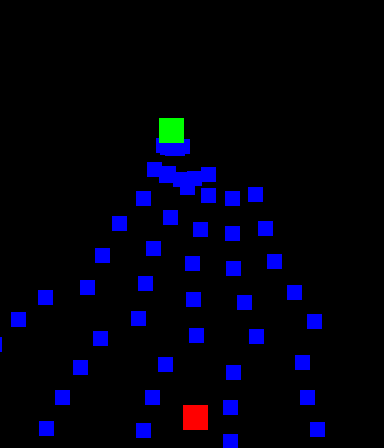
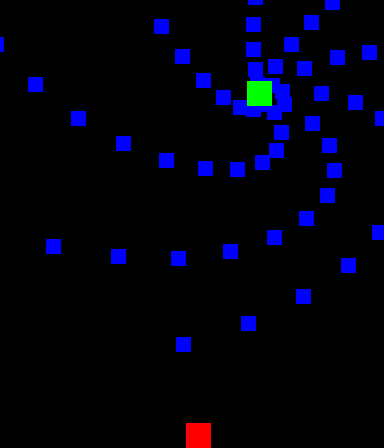
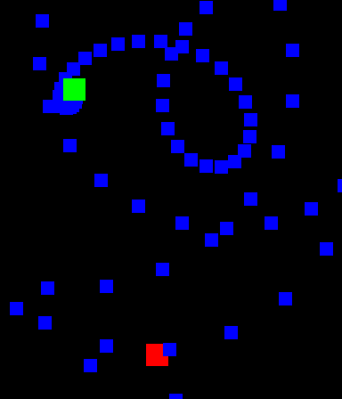
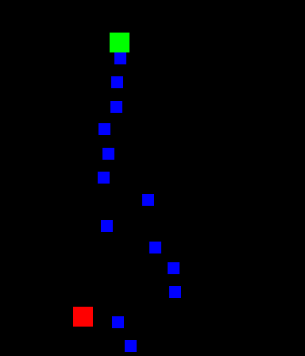

# bullettest
bullettest is a barebones [OpenAI Gym](https://github.com/openai/gym) environment modeled after a popular bullet hell game. It's quite basic and doesn't have much variety, but it should be an interesting enough benchmark for reinforcement learning algorithms.

   

For now, only one enemy is supported. There are a couple of randomized movement options:

* Static: The enemy stays in one place
* Sine: The enemy oscillates on the x-axis
* EaseOutExpo: The enemy is interpolated to a new position on a regular interval

And bullet patterns:

* Spiral: Bullets are shot out in a spiral from the enemy
* Direct: Bullets are shot directly towards the player with some spread on a regular interval
* Burst: Bullets are shot towards the player in evenly spaced batches on a regular interval

More complexity will probably be added once I can train a good model on what I have now.

# TODO
- [ ] Train a working model
- [ ] Curriculum learning
- [ ] More diverse enemy behavior
- [ ] Refactor common interface code into a library
- [ ] Port/rewrite [th6hook](https://github.com/khang06/th6hook)
- [ ] Support for manual environment resets
- [ ] Configurability